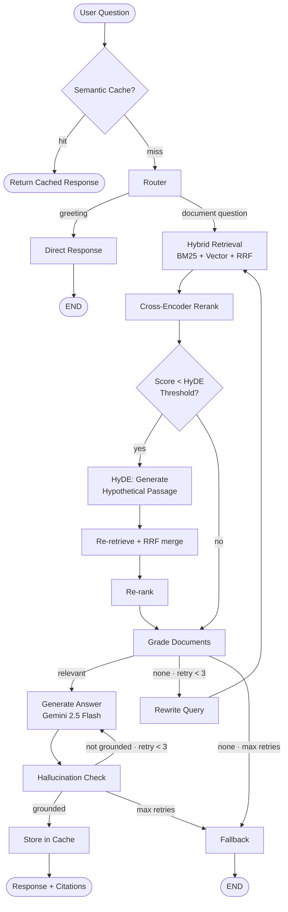
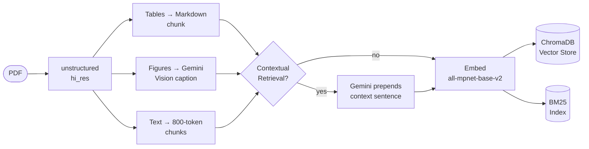

# DocuMind — Agentic Document Intelligence

> Chat with any PDF using a production-grade agentic pipeline powered by LangGraph, Gemini 2.5 Flash, hybrid search, and real-time streaming.

[](https://github.com/robayedl/documind/actions/workflows/ci.yml)


---

## Demo

https://github.com/user-attachments/assets/290e7caf-6676-43c2-9f9f-9df63d28c3f9

---

## Features

| Feature | Description |
|---|---|
| **Agentic RAG** | LangGraph pipeline with routing, grading, rewriting, and hallucination checking |
| **Hybrid Search** | BM25 + semantic vector search fused with Reciprocal Rank Fusion (RRF) |
| **Cross-Encoder Reranking** | `ms-marco-MiniLM-L-6-v2` reranker for high-precision results |
| **Semantic Cache** | Redis vector cache — repeated or near-identical queries return instantly |
| **HyDE Fallback** | On low reranker confidence, generates a hypothetical passage and re-retrieves |
| **Gemini 2.5 Flash** | Google's fastest frontier LLM for low-latency answers |
| **Streaming Responses** | Server-Sent Events (SSE) for real-time token-by-token output |
| **Conversation Memory** | Per-session chat history maintained across turns |
| **Rich PDF Parsing** | Table extraction (Markdown) and figure captioning via Gemini multimodal |
| **RAGAS Evaluation** | Faithfulness, answer relevancy, context precision & recall |

---

## Architecture

**Query Pipeline**



**Ingestion Pipeline**



---

## Tech Stack

| Layer | Technology |
|---|---|
| **API** | FastAPI, Uvicorn, Server-Sent Events |
| **Agent** | LangGraph, LangChain |
| **LLM** | Google Gemini 2.5 Flash |
| **Embeddings & Reranking** | HuggingFace `all-mpnet-base-v2`, `ms-marco-MiniLM-L-6-v2` |
| **Vector Store** | ChromaDB + BM25 (hybrid) |
| **Cache** | Redis Stack (vector similarity) |
| **PDF Parsing** | unstructured (hi_res), Gemini 2.5 Flash multimodal |
| **UI** | Streamlit |
| **Evaluation** | RAGAS |
| **CI/CD** | GitHub Actions, Docker |

---

## Quick Start

### Option 1 — Docker (Recommended)

```bash
git clone https://github.com/robayedl/documind.git
cd documind
```

```bash
cp .env.example .env   # add GOOGLE_API_KEY
```

```bash
docker compose up --build
```

| Service | URL |
|---|---|
| UI | http://localhost:8501 |
| API | http://localhost:8000 |
| API Docs | http://localhost:8000/docs |

### Option 2 — Local

```bash
git clone https://github.com/robayedl/documind.git
cd documind
```

```bash
# required for PDF parsing
# macOS: brew install tesseract poppler
# Linux: apt-get install tesseract-ocr poppler-utils
```

```bash
python -m venv .venv && source .venv/bin/activate
pip install -r requirements.txt
```

```bash
cp .env.example .env   # add GOOGLE_API_KEY
```

```bash
make run   # API on :8000
```

```bash
make ui    # UI on :8501
```

---

## API

| Method | Endpoint | Description |
|---|---|---|
| `GET` | `/health` | Health check |
| `POST` | `/documents` | Upload a PDF, returns `doc_id` |
| `POST` | `/documents/{doc_id}/index` | Parse, chunk, and index a document |
| `GET` | `/documents/{doc_id}/file` | Download the original PDF |
| `POST` | `/query` | Ask a question, get a JSON response |
| `POST` | `/query/stream` | Ask a question, receive SSE streaming tokens |

---

## Environment Variables

| Variable | Default | Description |
|---|---|---|
| `GOOGLE_API_KEY` | — | **Required.** Google AI Studio API key |
| `STORAGE_DIR` | `./storage` | Directory for uploaded PDFs |
| `CHROMA_DIR` | `./chroma_db` | ChromaDB persistence directory |
| `CORS_ORIGINS` | `http://localhost:8501` | Comma-separated allowed origins |
| `BACKEND_URL` | `http://localhost:8000` | Backend URL for Streamlit UI |
| `REDIS_URL` | `redis://localhost:6379` | Redis Stack connection URL |
| `SEMANTIC_CACHE_THRESHOLD` | `0.97` | Cosine similarity threshold for cache hit (0–1) |
| `CACHE_TTL_SECONDS` | `86400` | Cache TTL in seconds (default: 24 h) |
| `HYDE_THRESHOLD` | `0.3` | Reranker score below which HyDE is triggered |
| `EXTRACT_FIGURES` | `true` | Caption figures with Gemini 2.5 Flash multimodal (max 30/doc) |
| `CONTEXTUAL_RETRIEVAL` | `true` | Prepend per-chunk context before embedding |

---

## Evaluation

Results on a 30-question golden dataset built from **"Attention Is All You Need"** (Vaswani et al., 2017), scored by Gemini 2.5 Flash via [RAGAS](https://docs.ragas.io).

<!-- EVAL-RESULTS-START -->
| Metric | Score | |
|---|---|---|
| `faithfulness` | 0.974 | ███████████████████ |
| `answer_relevancy` | 0.764 | ███████████████ |
| `context_precision` | 0.917 | ██████████████████ |
| `context_recall` | 0.833 | ████████████████ |

_Evaluated on 30 questions · 2026-05-08 · full results in [`eval/results/latest.json`](eval/results/latest.json)_
<!-- EVAL-RESULTS-END -->

> Upload and index the PDF first (via the UI or API), then run evaluation with the returned `doc_id`.

```bash
DOC_ID=<your_doc_id> make eval   # full run (~10 min)
```

```bash
make update-readme               # refresh scores without re-running
```

See [eval/EVALUATION_GUIDE.md](eval/EVALUATION_GUIDE.md) for dataset format and cost estimates.

---

## Project Structure

```
documind/
├── app/          # FastAPI routes and storage helpers
├── rag/
│   ├── agents/   # LangGraph nodes: router, grader, generator, hallucination, rewriter
│   ├── chains/   # Retrieval (hybrid + HyDE), reranking, generation chains
│   ├── cache.py  # Redis semantic cache
│   └── ingest.py # PDF parsing — text, tables, figures
├── ui/           # Streamlit app and components
├── eval/         # RAGAS runner and golden dataset
└── tests/
```

---

## Tests

```bash
make test
```

```bash
make lint
```

---

## License

MIT — free to use, modify, and distribute.
