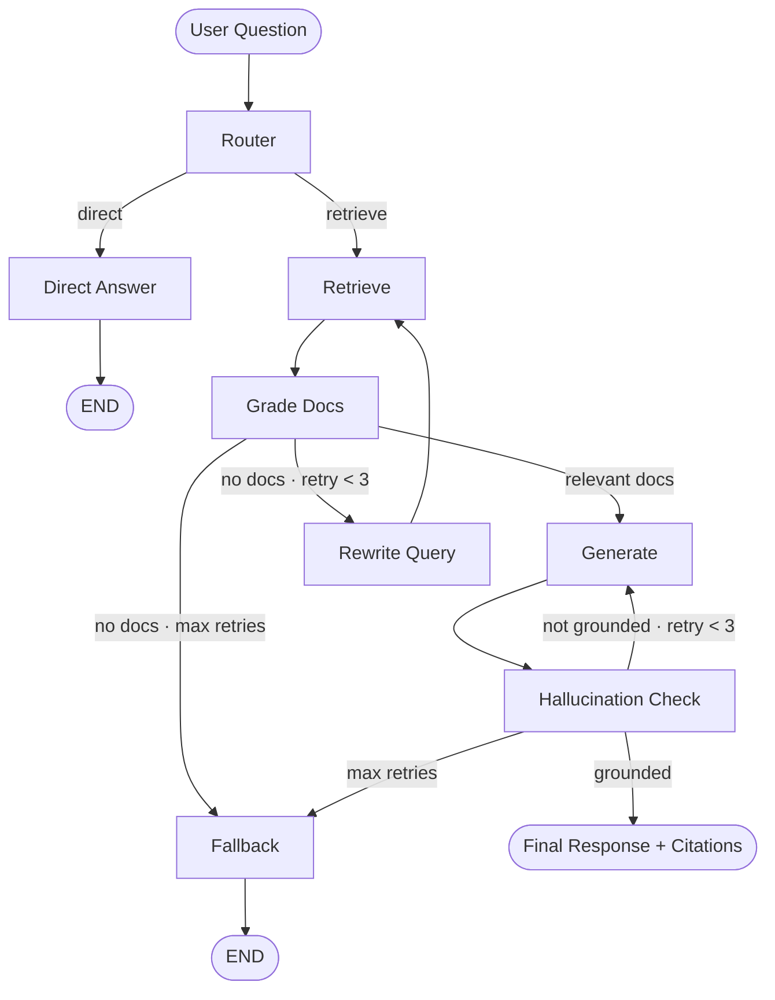

# RAG PDF Assistant — Agentic RAG System

> Chat with any PDF using a production-grade agentic pipeline powered by LangGraph, Gemini 2.5 Flash, hybrid search, and real-time streaming.

[](https://github.com/robayedl/rag-pdf-assistant/actions/workflows/ci.yml)


---

## Features

| Feature | Description |
|---|---|
| **Agentic RAG** | LangGraph pipeline with routing, grading, rewriting, and hallucination checking |
| **Hybrid Search** | BM25 + semantic vector search fused with Reciprocal Rank Fusion (RRF) |
| **Cross-Encoder Reranking** | `ms-marco-MiniLM-L-6-v2` reranker for high-precision results |
| **Gemini 2.5 Flash** | Google's fastest frontier LLM for low-latency answers |
| **Streaming Responses** | Server-Sent Events (SSE) for real-time token-by-token output |
| **Conversation Memory** | Per-session chat history maintained across turns |
| **RAGAS Evaluation** | Faithfulness, answer relevancy, context precision & recall |
| **Streamlit Chat UI** | Dark-theme UI with PDF viewer, SSE streaming, and source citations |
| **Docker Ready** | Full multi-service docker-compose setup (API + UI) |
| **AWS EC2 Deployment** | Production-ready for cloud deployment |

---

## Architecture



**Retrieval Pipeline:**
```
Query ──► BM25 Sparse Search  ─┐
                                ├──► RRF Fusion ──► Cross-Encoder Rerank ──► Top-K Chunks
Query ──► Vector Dense Search ─┘
```

---

## Tech Stack

| Layer | Technology |
|---|---|
| **API** | FastAPI 0.115, Uvicorn, Server-Sent Events |
| **Agent Framework** | LangGraph (StateGraph), LangChain |
| **LLM** | Google Gemini 2.5 Flash (`langchain-google-genai`) |
| **Embeddings** | HuggingFace `all-mpnet-base-v2` (768-dim) |
| **Vector Store** | ChromaDB 0.5 |
| **Sparse Search** | BM25 (`rank-bm25`) |
| **Reranker** | `cross-encoder/ms-marco-MiniLM-L-6-v2` |
| **PDF Parsing** | pdfplumber + Unicode normalization |
| **Chunking** | RecursiveCharacterTextSplitter (800 tokens, 100 overlap) |
| **UI** | Streamlit (dark theme, SSE streaming, PDF viewer) |
| **Evaluation** | RAGAS (faithfulness, answer relevancy, context precision/recall) |
| **Testing** | pytest + ruff |
| **CI/CD** | GitHub Actions |
| **Container** | Docker + docker-compose |

---

## Quick Start

### Option 1 — Docker (Recommended)

```bash
# 1. Clone the repo
git clone https://github.com/robayedl/rag-pdf-assistant.git
cd rag-pdf-assistant

# 2. Set your API key
cp .env.example .env
# Edit .env and add: GOOGLE_API_KEY=your_key_here

# 3. Launch everything
docker compose up --build
```

- **UI:** [http://localhost:8501](http://localhost:8501)
- **API:** [http://localhost:8000](http://localhost:8000)
- **API Docs:** [http://localhost:8000/docs](http://localhost:8000/docs)

---

### Option 2 — Local Development

**Prerequisites:** Python 3.12, pip

```bash
# 1. Clone & enter directory
git clone https://github.com/robayedl/rag-pdf-assistant.git
cd rag-pdf-assistant

# 2. Create virtual environment
python -m venv .venv
source .venv/bin/activate      # Windows: .venv\Scripts\activate

# 3. Install dependencies
pip install -r requirements.txt

# 4. Configure environment
cp .env.example .env
# Edit .env and set GOOGLE_API_KEY

# 5. Start backend (terminal 1)
uvicorn app.main:app --reload --port 8000

# 6. Start UI (terminal 2)
streamlit run ui/streamlit_app.py --server.port 8501
```

---

## API Documentation

| Method | Endpoint | Description |
|---|---|---|
| `GET` | `/health` | Health check — returns status and environment |
| `POST` | `/documents` | Upload a PDF file, returns `doc_id` |
| `POST` | `/documents/{doc_id}/index` | Parse, chunk, and index a document |
| `GET` | `/documents/{doc_id}/file` | Download the original PDF |
| `POST` | `/query` | Ask a question, get a full JSON response |
| `POST` | `/query/stream` | Ask a question, receive SSE streaming tokens |

### Example: Upload and query a PDF

```bash
# Upload
DOC_ID=$(curl -s -F "file=@document.pdf" http://localhost:8000/documents \
  | python3 -c "import sys,json; print(json.load(sys.stdin)['doc_id'])")

# Index
curl -s -X POST http://localhost:8000/documents/$DOC_ID/index

# Query (full response)
curl -s -X POST http://localhost:8000/query \
  -H "Content-Type: application/json" \
  -d "{\"doc_id\": \"$DOC_ID\", \"question\": \"What is this document about?\"}"

# Query (streaming)
curl -N -X POST http://localhost:8000/query/stream \
  -H "Content-Type: application/json" \
  -d "{\"doc_id\": \"$DOC_ID\", \"question\": \"Summarize the key points.\"}"
```

---

## Environment Variables

| Variable | Default | Description |
|---|---|---|
| `GOOGLE_API_KEY` | — | **Required.** Google AI Studio API key |
| `STORAGE_DIR` | `./storage` | Directory for uploaded PDFs |
| `CHROMA_DIR` | `./chroma_db` | ChromaDB persistence directory |
| `CORS_ORIGINS` | `http://localhost:8501` | Comma-separated allowed origins |
| `BACKEND_URL` | `http://localhost:8000` | Backend URL for Streamlit UI |

---

## Running Tests

```bash
# Run full test suite
pytest -q

# Run with coverage
pytest --cov=rag --cov=app -q

# Lint
ruff check .
```

---

## RAGAS Evaluation

Evaluate pipeline quality with [RAGAS](https://docs.ragas.io) metrics: faithfulness, answer relevancy, context precision, and context recall.

```bash
# 1. Upload and index your PDF (see API section above)

# 2. Update eval/test_queries.json with your doc_id and ground truth answers

# 3. Run evaluation
python eval/run_eval.py --doc-id <your_doc_id>

# 4. View results
cat eval/results.json
```

**Pass criteria:** `faithfulness ≥ 0.70` and `answer_relevancy ≥ 0.70`

---

## Project Structure

```
rag-pdf-assistant/
├── app/
│   ├── main.py              # FastAPI app — all routes + SSE streaming
│   └── storage.py           # doc_id generation, file path helpers
│
├── rag/
│   ├── agents/
│   │   ├── graph.py         # LangGraph StateGraph — full pipeline
│   │   ├── router.py        # Query router (retrieve vs. direct)
│   │   ├── grader.py        # Document relevance grader
│   │   ├── generator.py     # Answer generator (Gemini + chat history)
│   │   ├── hallucination.py # Groundedness checker
│   │   ├── rewriter.py      # Query rewriter for retry loop
│   │   └── memory.py        # Per-session conversation memory
│   ├── chains/
│   │   ├── retrieval.py     # Hybrid search + RRF fusion
│   │   └── rerank.py        # Cross-encoder reranker
│   ├── ingest.py            # PDF parsing (pdfplumber), chunking, indexing
│   ├── llm.py               # Gemini LLM + HuggingFace embeddings
│   └── store.py             # ChromaDB interface (collection versioning)
│
├── ui/
│   ├── streamlit_app.py     # Main Streamlit entrypoint
│   └── components/
│       ├── chat.py          # Chat interface + SSE streaming
│       ├── sidebar.py       # Upload, index, document management
│       └── pdf_viewer.py    # Inline PDF viewer
│
├── eval/
│   ├── test_queries.json    # Sample Q&A pairs for evaluation
│   ├── ragas_eval.py        # RAGAS metric computation
│   └── run_eval.py          # CLI runner + results table
│
├── tests/
│   ├── test_agent.py        # Agent node + graph integration tests
│   └── test_llm_pipeline.py # LLM init + embeddings tests
│
├── .env.example             # Environment variable template
├── .github/workflows/ci.yml # CI: lint + test on push/PR
├── Dockerfile               # Python 3.12 slim image
├── docker-compose.yml       # Multi-service: api + streamlit
└── requirements.txt
```

---

## Screenshots

> *Screenshots coming soon — upload a PDF, ask questions, see sources cited inline.*

---

## License

MIT — free to use, modify, and distribute.
